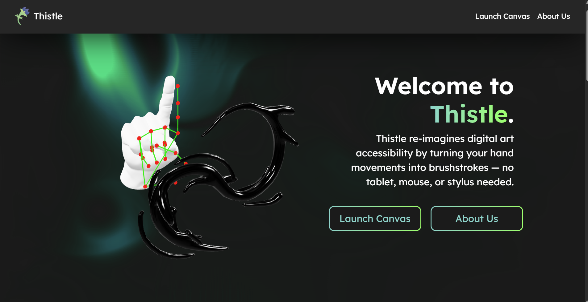
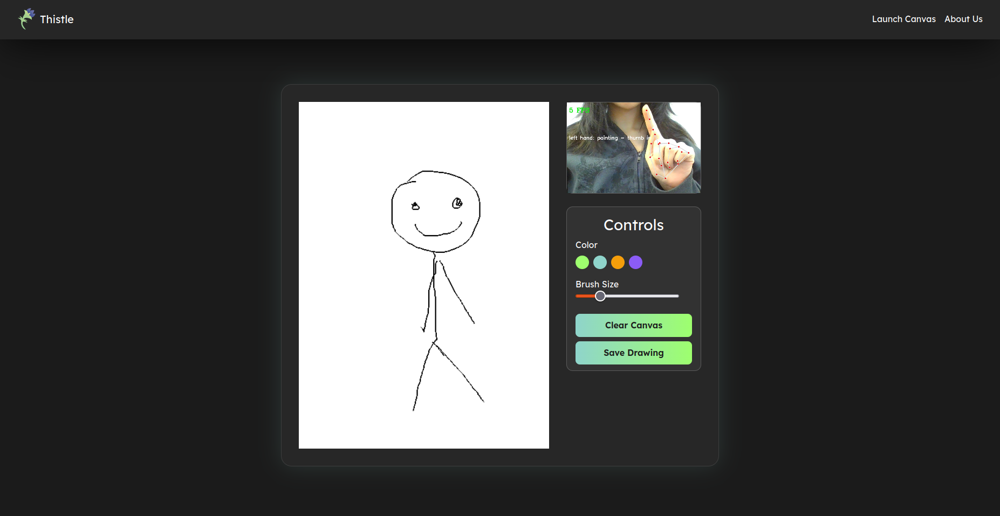
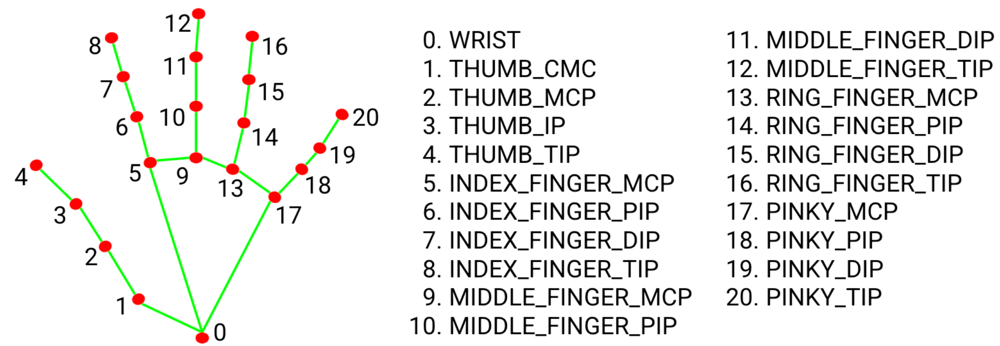

<p align="center">
 
</p>


# Introducing Thistle :art: 
**Re-imagining digital art accessibility by turning your hand movements into brushstrokes with AI— no tablet, mouse, or stylus needed.**

Girls Hoo Hack 2025 Official Submission by Ayan Rasulova (GitHub: ayanrasulova), Emilie Deadman (GitHub: echiino), Amelia Chen, Jack Ellis (GitHub: jackawackadoo)

## Inspiration:

Generative AI has become more powerful over the last few years, and a lot of discourse within art communities involves the idea that artists with disabilities are not able to create art without the use of generating drawings through prompt engineering. As passionate artists and software developers, we wanted to challenge this notion, offering an accessible machine learning alternative for digital drawing beyond the constraints of a mouse, tablet, or physical device. 

We chose the name Thistle because the thistle flower is a symbol of resilience — it thrives even in harsh conditions, standing tall despite hardship. That’s exactly how we see artists today: facing uncertainty, yet continuing to create and push the boundaries of expression.

## Features & How We Built It:



Thistle utilizes OpenCV and MediaPipe Hands to detect and track hand signals through a live webcam feed, using the hand landmark model bundle that measures the keypoint localization of 21 hand-knuckle coordinates, as listed above. Our custom motion-mapping algorithms classify specific hand gestures, including: 

- index finger with thumb pointing in (☝️) to navigate through the canvas
- dual fingers (🤘) to switch between drawing and erasing mode 
- index finger with thumb pointing out (👆) to interact with the canvas (drawing or erasing)
- finger pinch (🫰) to enter color selection mode 
- long swipe with both hands (🖐️) to clear the canvas
- thumbs up (👍) to save a screenshot of your drawing :)

These gestures are then transmitted in real-time via webcam using Flask to stream live frames (with ```/video_feed```) to run on localhost. We also export all live information on both gestures and x & y coordinates to ```gesture_data.json```, which we parse through to map different gestures to actions on our JavaScript canvas application. We then render the canvas on our front-end website (build with React, Node, Bootstrap, Motion, Vite, CSS, HTML, Tailwind).

## Run Instructions

First, make sure you have Node.js installed. You then need to run the setup script:

**You must be using Python 3.12 for the necessary libraries to work**

For Windows:
```bash
python setup.py
```

For Mac / Linux
```bash
python3 setup.py
```

If you are having issues with the script, ensure that whatever you are using to run this script is using the correct interpreter *(Python 3.12 in a virtual environment, this script should create the virtual environment for you but only if you start with a 3.12 interpreter)*

If these commands are saying you're on the wrong Python version, try running it through your IDE interface (like Visual Studio Code)

To run the server, first run 
``` npm install ``` 
to install the npm dependencies, then run 
``` npm run dev``` 
to start the server on your local host. 

If your webcam in "Launch Canvas" is not connecting right away, then run 
``` handtracking.py``` 
before running 
``` npm run dev``` 

## Challenges We Ran Into

We initially were running our live webcam feed locally in a window opened up by our Python script, but in order for us to integrate our OpenCV detection backend to our frontend successfully, we needed to refactor our Python files to output instead to localhost, which took a bit of time. 

## What We're Proud Of

We're proud that we got to create a full-stack application in such little time, integrating our backend with visually appealing UI/UX. We're also just extremely happy to center our work around accessibility. The four of us have been involved in similar works, like PosturePal, and we want to continue to strive and make technology accessible for everyone. 

## What's next for Thistle:

We have centered our design with consideration to those with Parkinson's, Dyspraxia, and carpal tunnel syndrome. However, we plan to allow for customization with our computer vision mappings, allowing people to map canvas interactions to kinesthetic movements that feel most comfortable for them.
